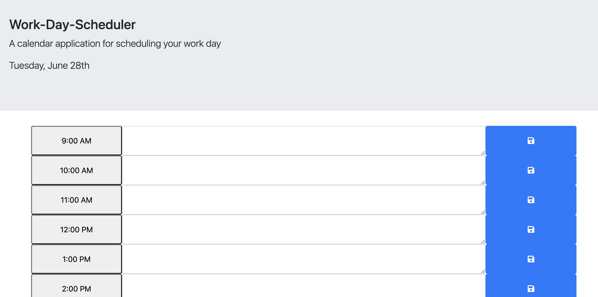

# Work-Day-Scheduler

# Description
AS AN employee with a busy schedul I WANT to add important events to a daily planner SO THAT I can manage my time effectively

# Usagae
To use this application, just open it up in your favorite browser, select the appropriate hour your tasks are due for, and write them in. Once that's done, hit the save button on the right. That way, if you close your window for any reason, you can see your tasks pop right back up on the screen.

# Technologies Used
HTML
JavaScript
CSS

# Image
)

# Link
https://garcia3325.github.io/Work-Day-Scheduler/
